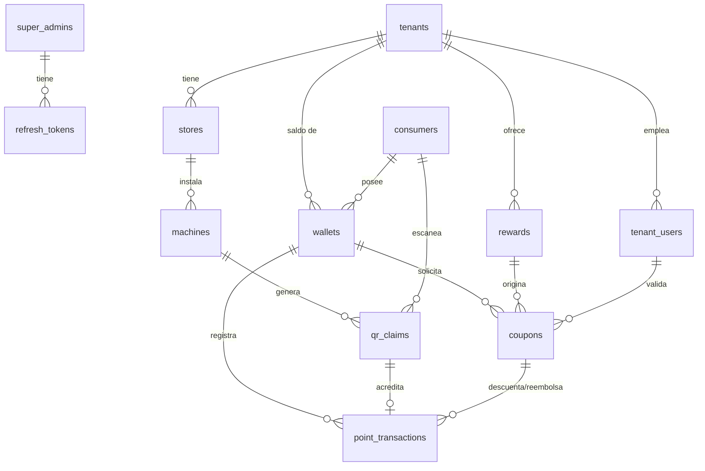

# Kairos — Esquema de Base de Datos

Versión 0.1 · Estado: propuesta para aprobación

Define el modelo de datos de PostgreSQL y su equivalente en Prisma. Complementa `docs/ARQUITECTURA.md` (secciones 4.1 a 4.4) y `context/contexto.md`. Corresponde al paso 1.1 de `context/planeacion.md`, ampliado con las decisiones de seguridad de la arquitectura.

## 1. Decisiones de diseño

| # | Decisión | Motivo |
|---|---|---|
| 1 | Un solo esquema compartido; toda tabla de negocio lleva `tenant_id` | Es la opción más simple para un SaaS pequeño. Esquema por tenant o base por tenant no se justifican con este volumen |
| 2 | El consumidor es **global**, no pertenece a un tenant. El saldo vive en `wallets` (consumidor × tenant) | Una persona con una sola cuenta en la Wallet acumula puntos en varias tiendas, cada una con su saldo aislado |
| 3 | Los puntos se llevan como **libro contable** (`point_transactions`, solo inserciones) más un saldo en `wallets` | Auditable. El saldo se puede recalcular y verificar contra el historial |
| 4 | Sucursal (`stores`) separada de empresa (`tenants`) | El QR y la API usan `store_id`. Un negocio con varias sucursales no requiere rediseño |
| 5 | Cada máquina tiene su propio par de llaves; la base guarda solo la **pública** | Ver `ARQUITECTURA.md` 4.2. Revocar una máquina no afecta a las demás |
| 6 | Los QR usados se guardan por `jti` único en `qr_claims` | La restricción `UNIQUE` hace imposible acreditar el mismo QR dos veces, incluso con peticiones simultáneas |
| 7 | Cupón y premio guardan **copia** del título y costo al momento del canje | Si el tenant edita o borra el premio, el historial no cambia |
| 8 | Claves primarias `uuid` (v7 si es posible) | No revelan volumen ni son adivinables en URLs |
| 9 | Borrado lógico (`deleted_at` o `status`) en entidades con historial | Nunca se borran filas que tengan transacciones asociadas |
| 10 | Aislamiento reforzado con claves foráneas compuestas `(tenant_id, id)` y RLS opcional | Una fila no puede apuntar a datos de otro tenant ni por error de código |

## 2. Diagrama entidad-relación



## 3. Tablas

Convención: `PK` clave primaria, `FK` foránea, `UQ` única. Todas las tablas llevan `created_at`; las mutables además `updated_at`.

### 3.1 Plataforma

**`super_admins`** — propietarios del SaaS. Tabla separada: no comparte login ni permisos con los tenants.

| Columna | Tipo | Notas |
|---|---|---|
| `id` | uuid PK | |
| `email` | text UQ | |
| `password_hash` | text | argon2id |
| `name` | text | |
| `is_active` | bool | default true |

**`tenants`** — empresas que pagan la suscripción.

| Columna | Tipo | Notas |
|---|---|---|
| `id` | uuid PK | |
| `name` | text | Nombre comercial |
| `slug` | text UQ | Para URLs de la Wallet (`/t/cafeteria-x`) |
| `status` | enum `TenantStatus` | `ACTIVE`, `SUSPENDED`, `CANCELLED` |
| `plan` | enum `Plan` | `TRIAL`, `BASIC`, `PRO`. Suficiente para el MVP; una tabla de suscripciones queda como mejora |
| `subscription_ends_at` | timestamptz null | Vencimiento; el super admin suspende manualmente o por tarea programada |
| `logo_url` | text null | Marca (`DISENO.md` 4.1) |
| `primary_color` | text | Hex `#RRGGBB`, con `CHECK` de formato |
| `secondary_color` | text null | |
| `theme_mode` | enum `ThemeMode` | `LIGHT`, `DARK`, `AUTO` |
| `score_per_point` | int | Cuántos puntos de juego equivalen a 1 punto de Wallet. Default 10 |
| `max_points_per_game` | int | Tope por partida (antifraude, `ARQUITECTURA.md` 4.2) |
| `max_games_per_day` | int | Tope diario por consumidor en este tenant |
| `deleted_at` | timestamptz null | |

Los tres últimos parámetros de puntos viven aquí porque cada negocio define su propia economía. El juego envía `score` crudo; el **servidor** calcula los puntos.

**`stores`** — sucursales. `store_id` es el identificador que lee la máquina.

| Columna | Tipo | Notas |
|---|---|---|
| `id` | uuid PK | |
| `tenant_id` | uuid FK | |
| `name` | text | |
| `address` | text null | |
| `is_active` | bool | |
| | UQ `(tenant_id, id)` | Objetivo de claves foráneas compuestas |

**`machines`** — terminales Arcade.

| Columna | Tipo | Notas |
|---|---|---|
| `id` | uuid PK | `machine_id` del JWT |
| `tenant_id` | uuid FK | |
| `store_id` | uuid FK | FK compuesta `(tenant_id, store_id)` |
| `label` | text | Ej. "Arcade mostrador" |
| `public_key` | text | PEM o JWK. Solo la pública |
| `key_algorithm` | enum | `ES256`, `EDDSA` |
| `status` | enum `MachineStatus` | `ACTIVE`, `REVOKED` |
| `last_seen_at` | timestamptz null | Diagnóstico |
| `revoked_at` | timestamptz null | |

### 3.2 Usuarios y sesiones

**`tenant_users`** — dueño y empleados de un tenant.

| Columna | Tipo | Notas |
|---|---|---|
| `id` | uuid PK | |
| `tenant_id` | uuid FK | |
| `store_id` | uuid null | Si es `TENANT_STAFF`, sucursal donde opera. Null = todas |
| `email` | text | UQ `(tenant_id, email)` |
| `password_hash` | text | |
| `name` | text | |
| `role` | enum `TenantRole` | `TENANT_ADMIN`, `TENANT_STAFF` |
| `is_active` | bool | |

**`consumers`** — jugadores. Login por correo o teléfono (Google queda para una etapa posterior: agregarlo será una columna nullable `google_sub` en una migración, sin rediseño). Ambos identificadores son opcionales, pero se exige al menos uno con un `CHECK`.

| Columna | Tipo | Notas |
|---|---|---|
| `id` | uuid PK | |
| `phone` | text UQ null | Formato E.164 |
| `phone_verified_at` | timestamptz null | |
| `email` | text UQ null | Se guarda en minúsculas |
| `email_verified_at` | timestamptz null | |
| `display_name` | text null | |
| `preferred_theme` | enum null | El consumidor puede sobrescribir el tema del tenant |
| `deleted_at` | timestamptz null | Anonimizar en lugar de borrar |

**`refresh_tokens`** — rotación de refresh tokens (`ARQUITECTURA.md` 4.4). Un solo modelo para los tres tipos de sujeto.

| Columna | Tipo | Notas |
|---|---|---|
| `id` | uuid PK | |
| `subject_type` | enum | `SUPER_ADMIN`, `TENANT_USER`, `CONSUMER` |
| `subject_id` | uuid | Sin FK real (apunta a tablas distintas). Índice `(subject_type, subject_id)` |
| `token_hash` | text UQ | Se guarda el hash, nunca el token |
| `family_id` | uuid | Detecta reutilización: si un token ya rotado reaparece, se revoca toda la familia |
| `expires_at` | timestamptz | |
| `revoked_at` | timestamptz null | |

### 3.3 Puntos y premios

**`wallets`** — saldo de un consumidor en un tenant.

| Columna | Tipo | Notas |
|---|---|---|
| `id` | uuid PK | |
| `tenant_id` | uuid FK | |
| `consumer_id` | uuid FK | |
| `balance` | int | `CHECK (balance >= 0)`. Copia derivada del libro |
| `lifetime_earned` | int | Acumulado histórico, útil para analítica y niveles futuros |
| | UQ `(tenant_id, consumer_id)` | Una billetera por par |
| | UQ `(tenant_id, id)` | Para FK compuestas |

Se crea de forma perezosa en el primer escaneo de un QR del tenant.

**`rewards`** — catálogo de premios del tenant.

| Columna | Tipo | Notas |
|---|---|---|
| `id` | uuid PK | |
| `tenant_id` | uuid FK | |
| `title` | text | |
| `description` | text null | |
| `image_url` | text null | |
| `points_cost` | int | `CHECK (points_cost > 0)` |
| `stock` | int null | Lo define el tenant al crear o editar el premio. Null = ilimitado. `CHECK (stock >= 0)` |
| `is_active` | bool | Ocultar sin borrar |
| `deleted_at` | timestamptz null | |
| | UQ `(tenant_id, id)` | |

**`qr_claims`** — cada QR de la máquina que se intentó acreditar. Es la barrera contra repetición.

| Columna | Tipo | Notas |
|---|---|---|
| `id` | uuid PK | |
| `jti` | text UQ | Id único del JWT. **La restricción UQ es la defensa clave** |
| `tenant_id` | uuid FK | |
| `machine_id` | uuid FK | |
| `consumer_id` | uuid FK | |
| `score` | int | Puntaje crudo firmado por la máquina |
| `points_awarded` | int | Ya con `score_per_point` y tope aplicados |
| `qr_issued_at` | timestamptz | `iat` del JWT |
| `reward_id` | uuid FK null | Recompensa que anunciaba el QR (ruleta). Null = QR de puntos; en ese caso `points_awarded` es 0 |

Solo se insertan QR válidos y acreditados. Limpieza: las filas con más de la ventana de `exp` no se necesitan para evitar repetición (el JWT ya estaría vencido), pero se conservan como historial de juego.

**`point_transactions`** — libro contable. **Solo inserciones**, nunca `UPDATE` ni `DELETE`.

| Columna | Tipo | Notas |
|---|---|---|
| `id` | uuid PK | |
| `tenant_id` | uuid FK | |
| `wallet_id` | uuid FK | FK compuesta `(tenant_id, wallet_id)` |
| `type` | enum `TxType` | `EARN`, `REDEEM`, `REFUND`, `ADJUST` |
| `points` | int | Con signo: `EARN` +, `REDEEM` −, `REFUND` +, `ADJUST` ±. `CHECK (points <> 0)` |
| `balance_after` | int | Saldo resultante; permite auditar sin recalcular |
| `qr_claim_id` | uuid UQ null | Solo `EARN`. UQ evita doble acreditación |
| `coupon_id` | uuid null | Solo `REDEEM` y `REFUND` |
| `note` | text null | Obligatoria en `ADJUST` |
| `created_by_id` | uuid null | Quién hizo un `ADJUST` manual |

**`coupons`** — canje pendiente, entregado o vencido. Es el "OTP" del flujo.

| Columna | Tipo | Notas |
|---|---|---|
| `id` | uuid PK | |
| `tenant_id` | uuid FK | |
| `wallet_id` | uuid FK | FK compuesta |
| `reward_id` | uuid FK | FK compuesta `(tenant_id, reward_id)` |
| `reward_title` | text | Copia al momento del canje |
| `points_cost` | int | Copia al momento del canje |
| `code` | text | Generado en servidor, aleatorio criptográfico, 6–8 caracteres sin ambiguos (sin 0/O, 1/I) |
| `status` | enum `CouponStatus` | `PENDING`, `REDEEMED`, `EXPIRED`, `CANCELLED` |
| `expires_at` | timestamptz | Vida corta configurable |
| `redeemed_at` | timestamptz null | |
| `redeemed_by_id` | uuid FK null | `tenant_users.id` que lo entregó |
| `redeemed_store_id` | uuid null | Sucursal donde se entregó |
| `qr_claim_id` | uuid UQ null | Premio ganado en la ruleta: el QR que lo originó. UQ evita entregarlo dos veces. En estos cupones `points_cost` es 0 |
| | UQ parcial `(tenant_id, code) WHERE status = 'PENDING'` | El código solo debe ser único entre cupones vivos |

### 3.4 Auditoría

**`audit_logs`** — acciones administrativas sensibles.

| Columna | Tipo | Notas |
|---|---|---|
| `id` | uuid PK | |
| `tenant_id` | uuid null | Null = acción de plataforma |
| `actor_type` / `actor_id` | enum / uuid | Quién |
| `action` | text | Ej. `tenant.suspend`, `machine.revoke`, `points.adjust` |
| `target_type` / `target_id` | text / uuid | Sobre qué |
| `metadata` | jsonb | Antes y después |
| `ip` | inet null | |

## 4. Reglas de integridad que la base debe garantizar

Estas reglas no dependen del código de la API. Las impone PostgreSQL.

1. **QR de un solo uso:** `UNIQUE (qr_claims.jti)`.
2. **Saldo nunca negativo:** `CHECK (wallets.balance >= 0)`.
3. **Una billetera por consumidor y tenant:** `UNIQUE (tenant_id, consumer_id)`.
4. **Un acreditamiento por QR:** `UNIQUE (point_transactions.qr_claim_id)`.
5. **Sin cruce entre tenants:** claves foráneas compuestas `(tenant_id, x_id)` en `machines→stores`, `wallets`, `point_transactions→wallets`, `coupons→wallets` y `coupons→rewards`.
6. **Libro inmutable:** un trigger rechaza `UPDATE` y `DELETE` sobre `point_transactions`.
7. **Cupón atómico:** el paso `PENDING → REDEEMED` se hace con `UPDATE ... WHERE id = $1 AND status = 'PENDING' AND expires_at > now()` y se verifica que afectó 1 fila.
8. **Colores válidos:** `CHECK (primary_color ~ '^#[0-9A-Fa-f]{6}$')`, igual para `secondary_color`.

## 5. Operaciones críticas (transacciones)

### 5.1 Acreditar puntos por QR

Una sola transacción:

1. Verificar firma con la llave pública de `machine_id`; comprobar `exp`, máquina `ACTIVE`, tenant `ACTIVE`.
2. `INSERT qr_claims` → si viola `UNIQUE (jti)`, responder "QR ya usado".
3. Calcular `points_awarded = min(score / score_per_point, max_points_per_game)`; comprobar `max_games_per_day`.
4. `INSERT wallets ... ON CONFLICT DO NOTHING`, luego `SELECT ... FOR UPDATE` sobre la billetera.
5. `UPDATE wallets SET balance = balance + n, lifetime_earned = lifetime_earned + n`.
6. `INSERT point_transactions (type = EARN, ...)`.

### 5.2 Canjear premio

Una sola transacción:

1. `SELECT wallets ... FOR UPDATE`; validar `balance >= points_cost`, premio activo y con stock.
2. `UPDATE wallets SET balance = balance - cost`.
3. `INSERT coupons (status = PENDING, code, expires_at, copias de título y costo)`.
4. `INSERT point_transactions (type = REDEEM, points = -cost, coupon_id)`.
5. Si `stock` no es null: `UPDATE rewards SET stock = stock - 1 WHERE id = $1 AND stock > 0`; si afecta 0 filas, se revierte todo y se responde "agotado".

### 5.3 Validar en caja

`UPDATE coupons SET status = 'REDEEMED', redeemed_at = now(), redeemed_by_id = $staff WHERE tenant_id = $t AND code = $c AND status = 'PENDING' AND expires_at > now()`. Si afecta 0 filas: código inválido, vencido o ya usado.

### 5.4 Cupón vencido o cancelado

Decisión tomada: **los puntos se devuelven**.

Tarea programada (cada minuto o cada hora) que, por cada cupón `PENDING` con `expires_at` pasado, en una sola transacción:

1. `UPDATE coupons SET status = 'EXPIRED' WHERE id = $1 AND status = 'PENDING'`; si afecta 0 filas, otro proceso ya lo tomó y se omite.
2. `UPDATE wallets SET balance = balance + points_cost` (con `lifetime_earned` sin cambios: un reembolso no es ganancia).
3. `INSERT point_transactions (type = REFUND, points = +points_cost, coupon_id)`.
4. Si el premio tiene `stock` no nulo: `UPDATE rewards SET stock = stock + 1`.

La cancelación manual (`CANCELLED`, por el tenant) sigue el mismo flujo.

## 6. Índices

| Tabla | Índice | Para qué |
|---|---|---|
| `stores` | `(tenant_id)` | Listado del panel |
| `machines` | `(tenant_id, store_id)` | Listado |
| `tenant_users` | UQ `(tenant_id, email)` | Login |
| `wallets` | UQ `(tenant_id, consumer_id)`; `(consumer_id)` | Saldo por tienda; lista de tiendas del consumidor |
| `rewards` | `(tenant_id, is_active)` | Catálogo de la Wallet |
| `qr_claims` | UQ `(jti)`; `(tenant_id, created_at)`; `(consumer_id, tenant_id, created_at)` | Antirepetición; analítica; tope diario |
| `point_transactions` | `(wallet_id, created_at DESC)`; `(tenant_id, created_at)` | Historial y analítica |
| `coupons` | UQ parcial `(tenant_id, code) WHERE status = 'PENDING'`; `(wallet_id, created_at DESC)`; `(tenant_id, status, expires_at)` | Validación en caja; historial; tarea de vencimiento |
| `refresh_tokens` | UQ `(token_hash)`; `(subject_type, subject_id)`; `(family_id)` | Rotación y revocación |
| `audit_logs` | `(tenant_id, created_at DESC)` | Consulta |

## 7. Esquema Prisma

Archivo destino: `apps/api/prisma/schema.prisma`.

Notas de implementación:

- Prisma no expresa `CHECK`, índices únicos parciales ni triggers. Van en un archivo SQL dentro de la primera migración (`prisma migrate dev --create-only`, luego editar).
- Las claves foráneas compuestas sí se declaran en Prisma (`fields: [tenantId, storeId], references: [tenantId, id]`).
- El filtro por `tenant_id` se centraliza en una extensión de Prisma (`ARQUITECTURA.md` 4.1).

```prisma
generator client {
  provider = "prisma-client-js"
}

datasource db {
  provider = "postgresql"
  url      = env("DATABASE_URL")
}

// ───────── Enums ─────────

enum TenantStatus {
  ACTIVE
  SUSPENDED
  CANCELLED
}
enum Plan {
  TRIAL
  BASIC
  PRO
}
enum ThemeMode {
  LIGHT
  DARK
  AUTO
}
enum TenantRole {
  TENANT_ADMIN
  TENANT_STAFF
}
enum MachineStatus {
  ACTIVE
  REVOKED
}
enum KeyAlgorithm {
  ES256
  EDDSA
}
enum TxType {
  EARN
  REDEEM
  REFUND
  ADJUST
}
enum CouponStatus {
  PENDING
  REDEEMED
  EXPIRED
  CANCELLED
}
enum SubjectType {
  SUPER_ADMIN
  TENANT_USER
  CONSUMER
}

// ───────── Plataforma ─────────

model SuperAdmin {
  id           String   @id @default(uuid()) @db.Uuid
  email        String   @unique
  passwordHash String   @map("password_hash")
  name         String
  isActive     Boolean  @default(true) @map("is_active")
  createdAt    DateTime @default(now()) @map("created_at")
  updatedAt    DateTime @updatedAt @map("updated_at")

  @@map("super_admins")
}

model Tenant {
  id                 String       @id @default(uuid()) @db.Uuid
  name               String
  slug               String       @unique
  status             TenantStatus @default(ACTIVE)
  plan               Plan         @default(TRIAL)
  subscriptionEndsAt DateTime?    @map("subscription_ends_at")

  logoUrl        String?   @map("logo_url")
  primaryColor   String    @default("#7C3AED") @map("primary_color")
  secondaryColor String?   @map("secondary_color")
  themeMode      ThemeMode @default(AUTO) @map("theme_mode")

  scorePerPoint    Int @default(10) @map("score_per_point")
  maxPointsPerGame Int @default(50) @map("max_points_per_game")
  maxGamesPerDay   Int @default(10) @map("max_games_per_day")

  createdAt DateTime  @default(now()) @map("created_at")
  updatedAt DateTime  @updatedAt @map("updated_at")
  deletedAt DateTime? @map("deleted_at")

  stores      Store[]
  machines    Machine[]
  tenantUsers TenantUser[]
  wallets     Wallet[]
  rewards     Reward[]
  coupons     Coupon[]
  transactions PointTransaction[]
  qrClaims    QrClaim[]

  @@map("tenants")
}

model Store {
  id        String   @id @default(uuid()) @db.Uuid
  tenantId  String   @map("tenant_id") @db.Uuid
  name      String
  address   String?
  isActive  Boolean  @default(true) @map("is_active")
  createdAt DateTime @default(now()) @map("created_at")
  updatedAt DateTime @updatedAt @map("updated_at")

  tenant   Tenant       @relation(fields: [tenantId], references: [id])
  machines Machine[]
  staff    TenantUser[]

  @@unique([tenantId, id])
  @@index([tenantId])
  @@map("stores")
}

model Machine {
  id           String        @id @default(uuid()) @db.Uuid
  tenantId     String        @map("tenant_id") @db.Uuid
  storeId      String        @map("store_id") @db.Uuid
  label        String
  publicKey    String        @map("public_key")
  keyAlgorithm KeyAlgorithm  @default(ES256) @map("key_algorithm")
  status       MachineStatus @default(ACTIVE)
  lastSeenAt   DateTime?     @map("last_seen_at")
  revokedAt    DateTime?     @map("revoked_at")
  createdAt    DateTime      @default(now()) @map("created_at")
  updatedAt    DateTime      @updatedAt @map("updated_at")

  tenant   Tenant    @relation(fields: [tenantId], references: [id])
  store    Store     @relation(fields: [tenantId, storeId], references: [tenantId, id])
  qrClaims QrClaim[]

  @@index([tenantId, storeId])
  @@map("machines")
}

// ───────── Usuarios y sesiones ─────────

model TenantUser {
  id           String     @id @default(uuid()) @db.Uuid
  tenantId     String     @map("tenant_id") @db.Uuid
  storeId      String?    @map("store_id") @db.Uuid
  email        String
  passwordHash String     @map("password_hash")
  name         String
  role         TenantRole
  isActive     Boolean    @default(true) @map("is_active")
  createdAt    DateTime   @default(now()) @map("created_at")
  updatedAt    DateTime   @updatedAt @map("updated_at")

  tenant           Tenant   @relation(fields: [tenantId], references: [id])
  store            Store?   @relation(fields: [storeId], references: [id])
  redeemedCoupons  Coupon[]

  @@unique([tenantId, email])
  @@map("tenant_users")
}

model Consumer {
  id             String     @id @default(uuid()) @db.Uuid
  phone           String?   @unique
  phoneVerifiedAt DateTime? @map("phone_verified_at")
  email           String?   @unique
  emailVerifiedAt DateTime? @map("email_verified_at")
  displayName    String?    @map("display_name")
  preferredTheme ThemeMode? @map("preferred_theme")
  createdAt      DateTime   @default(now()) @map("created_at")
  updatedAt      DateTime   @updatedAt @map("updated_at")
  deletedAt      DateTime?  @map("deleted_at")

  wallets  Wallet[]
  qrClaims QrClaim[]

  // CHECK (phone IS NOT NULL OR email IS NOT NULL) → SQL manual
  @@map("consumers")
}

model RefreshToken {
  id          String      @id @default(uuid()) @db.Uuid
  subjectType SubjectType @map("subject_type")
  subjectId   String      @map("subject_id") @db.Uuid
  tokenHash   String      @unique @map("token_hash")
  familyId    String      @map("family_id") @db.Uuid
  expiresAt   DateTime    @map("expires_at")
  revokedAt   DateTime?   @map("revoked_at")
  createdAt   DateTime    @default(now()) @map("created_at")

  @@index([subjectType, subjectId])
  @@index([familyId])
  @@map("refresh_tokens")
}

// ───────── Puntos y premios ─────────

model Wallet {
  id             String   @id @default(uuid()) @db.Uuid
  tenantId       String   @map("tenant_id") @db.Uuid
  consumerId     String   @map("consumer_id") @db.Uuid
  balance        Int      @default(0) // CHECK (balance >= 0) → SQL manual
  lifetimeEarned Int      @default(0) @map("lifetime_earned")
  createdAt      DateTime @default(now()) @map("created_at")
  updatedAt      DateTime @updatedAt @map("updated_at")

  tenant       Tenant             @relation(fields: [tenantId], references: [id])
  consumer     Consumer           @relation(fields: [consumerId], references: [id])
  transactions PointTransaction[]
  coupons      Coupon[]

  @@unique([tenantId, consumerId])
  @@unique([tenantId, id])
  @@index([consumerId])
  @@map("wallets")
}

model Reward {
  id          String    @id @default(uuid()) @db.Uuid
  tenantId    String    @map("tenant_id") @db.Uuid
  title       String
  description String?
  imageUrl    String?   @map("image_url")
  pointsCost  Int       @map("points_cost") // CHECK (points_cost > 0) → SQL manual
  stock       Int? // null = ilimitado; CHECK (stock >= 0) → SQL manual
  isActive    Boolean   @default(true) @map("is_active")
  createdAt   DateTime  @default(now()) @map("created_at")
  updatedAt   DateTime  @updatedAt @map("updated_at")
  deletedAt   DateTime? @map("deleted_at")

  tenant  Tenant   @relation(fields: [tenantId], references: [id])
  coupons Coupon[]

  @@unique([tenantId, id])
  @@index([tenantId, isActive])
  @@map("rewards")
}

model QrClaim {
  id            String   @id @default(uuid()) @db.Uuid
  jti           String   @unique
  tenantId      String   @map("tenant_id") @db.Uuid
  machineId     String   @map("machine_id") @db.Uuid
  consumerId    String   @map("consumer_id") @db.Uuid
  score         Int
  pointsAwarded Int      @map("points_awarded")
  qrIssuedAt    DateTime @map("qr_issued_at")
  createdAt     DateTime @default(now()) @map("created_at")

  tenant      Tenant            @relation(fields: [tenantId], references: [id])
  machine     Machine           @relation(fields: [machineId], references: [id])
  consumer    Consumer          @relation(fields: [consumerId], references: [id])
  transaction PointTransaction?

  @@index([tenantId, createdAt])
  @@index([consumerId, tenantId, createdAt])
  @@map("qr_claims")
}

model PointTransaction {
  id           String   @id @default(uuid()) @db.Uuid
  tenantId     String   @map("tenant_id") @db.Uuid
  walletId     String   @map("wallet_id") @db.Uuid
  type         TxType
  points       Int      // con signo; CHECK (points <> 0) → SQL manual
  balanceAfter Int      @map("balance_after")
  qrClaimId    String?  @unique @map("qr_claim_id") @db.Uuid
  couponId     String?  @map("coupon_id") @db.Uuid
  note         String?
  createdById  String?  @map("created_by_id") @db.Uuid
  createdAt    DateTime @default(now()) @map("created_at")

  tenant  Tenant   @relation(fields: [tenantId], references: [id])
  wallet  Wallet   @relation(fields: [tenantId, walletId], references: [tenantId, id])
  qrClaim QrClaim? @relation(fields: [qrClaimId], references: [id])
  coupon  Coupon?  @relation(fields: [couponId], references: [id])

  @@index([walletId, createdAt(sort: Desc)])
  @@index([tenantId, createdAt])
  @@map("point_transactions")
}

model Coupon {
  id              String       @id @default(uuid()) @db.Uuid
  tenantId        String       @map("tenant_id") @db.Uuid
  walletId        String       @map("wallet_id") @db.Uuid
  rewardId        String       @map("reward_id") @db.Uuid
  rewardTitle     String       @map("reward_title")
  pointsCost      Int          @map("points_cost")
  code            String
  status          CouponStatus @default(PENDING)
  expiresAt       DateTime     @map("expires_at")
  redeemedAt      DateTime?    @map("redeemed_at")
  redeemedById    String?      @map("redeemed_by_id") @db.Uuid
  redeemedStoreId String?      @map("redeemed_store_id") @db.Uuid
  createdAt       DateTime     @default(now()) @map("created_at")
  updatedAt       DateTime     @updatedAt @map("updated_at")

  tenant       Tenant             @relation(fields: [tenantId], references: [id])
  wallet       Wallet             @relation(fields: [tenantId, walletId], references: [tenantId, id])
  reward       Reward             @relation(fields: [tenantId, rewardId], references: [tenantId, id])
  redeemedBy   TenantUser?        @relation(fields: [redeemedById], references: [id])
  transactions PointTransaction[]

  // UNIQUE parcial (tenant_id, code) WHERE status = 'PENDING' → SQL manual
  @@index([walletId, createdAt(sort: Desc)])
  @@index([tenantId, status, expiresAt])
  @@map("coupons")
}

// ───────── Auditoría ─────────

model AuditLog {
  id         String      @id @default(uuid()) @db.Uuid
  tenantId   String?     @map("tenant_id") @db.Uuid
  actorType  SubjectType @map("actor_type")
  actorId    String      @map("actor_id") @db.Uuid
  action     String
  targetType String?     @map("target_type")
  targetId   String?     @map("target_id") @db.Uuid
  metadata   Json?
  ip         String?
  createdAt  DateTime    @default(now()) @map("created_at")

  @@index([tenantId, createdAt(sort: Desc)])
  @@map("audit_logs")
}
```

## 8. Decisiones y pendientes

Resueltas:

- Cupón vencido: se devuelven los puntos (sección 5.4).
- Login del consumidor: correo o teléfono, sin Google por ahora.
- Stock de premios: lo configura cada tenant; vacío significa ilimitado. Se devuelve al vencer o cancelar el cupón.

Hechas:

- `schema.prisma` validado y migración `init` aplicada (con el SQL manual de la sección 4) en `apps/api/prisma/`.

Abiertas:

1. **Cómo se verifica el correo o teléfono:** recomiendo código de un solo uso enviado por correo (sin contraseña). El SMS tiene costo por mensaje y conviene dejarlo para después. Si se acepta, se agrega una tabla `login_codes` (destino, hash del código, expiración, intentos).
2. **Un empleado en varias sucursales:** hoy `tenant_users.store_id` admite una o todas. Si hace falta un subconjunto, se agrega tabla intermedia.
3. **Suscripciones:** el MVP usa `plan` y `subscription_ends_at`. Si se integra pasarela de pago, se crea una tabla `subscriptions` con historial de pagos.
4. **RLS de PostgreSQL:** activarlo en el parcial 1 o dejarlo como endurecimiento posterior. Requiere `SET LOCAL app.tenant_id` por transacción.
